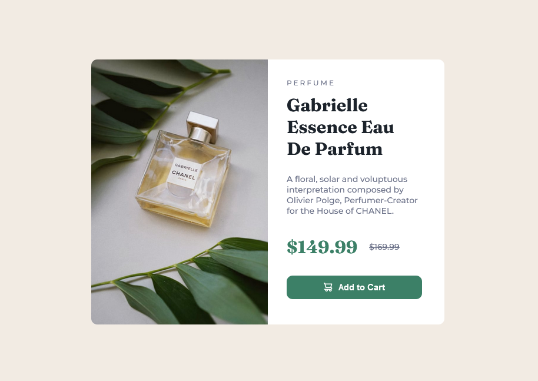

# Frontend Mentor - Product preview card component solution

This is my solution to the "Product preview card component challenge on Frontend Mentor" (https://www.frontendmentor.io/challenges/product-preview-card-component-GO7UmttRfa).

### Overview
The challenge
Users should be able to:
- View the optimal layout depending on their device's screen size
- See hover and focus states for interactive elements

Screenshot

## My process
Built with
- Semantic HTML5 markup
- CSS
- Flexbox
- Responsive design
- Media queries
- "<picture>" element

### What I learned
While working on this project, I practiced building a responsive layout using Flexbox and media queries.
I also learned how to use the "<picture>" element with different image sources for different screen sizes.
One of the challenges I faced was making the product image and card layout work properly across different viewport widths, especially on smaller screens.
This project also helped me practice using the CSS box model, sizing elements, spacing, and debugging layout issues using browser developer tools.

### Continued development
I want to continue improving my responsive design skills, especially when working with smaller screen sizes.
I also want to become more confident in identifying and solving CSS layout problems independently.

## AI Collaboration
I used ChatGPT as a learning and debugging assistant during this project.
I used it to help me understand CSS concepts, identify layout issues, and work through responsive design problems.
I still implemented and tested the changes myself, using the explanations and hints to understand why the solution worked.

## Author
- Frontend Mentor - "@veefah" (https://www.frontendmentor.io/profile/veefah)
- GitHub - "@veefah" (https://github.com/veefah)
